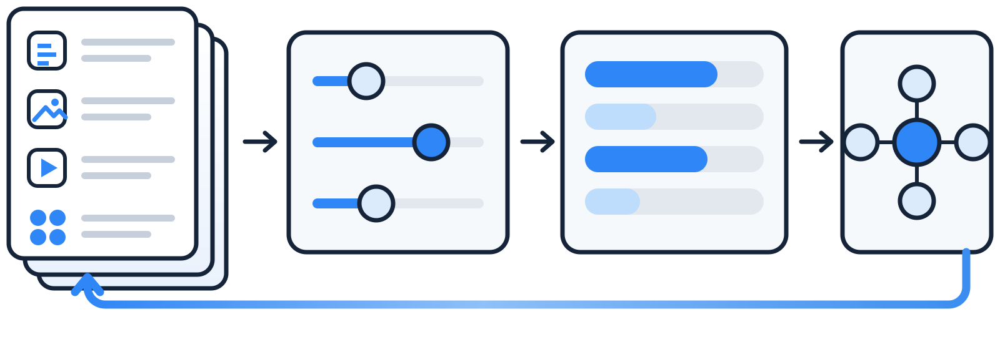
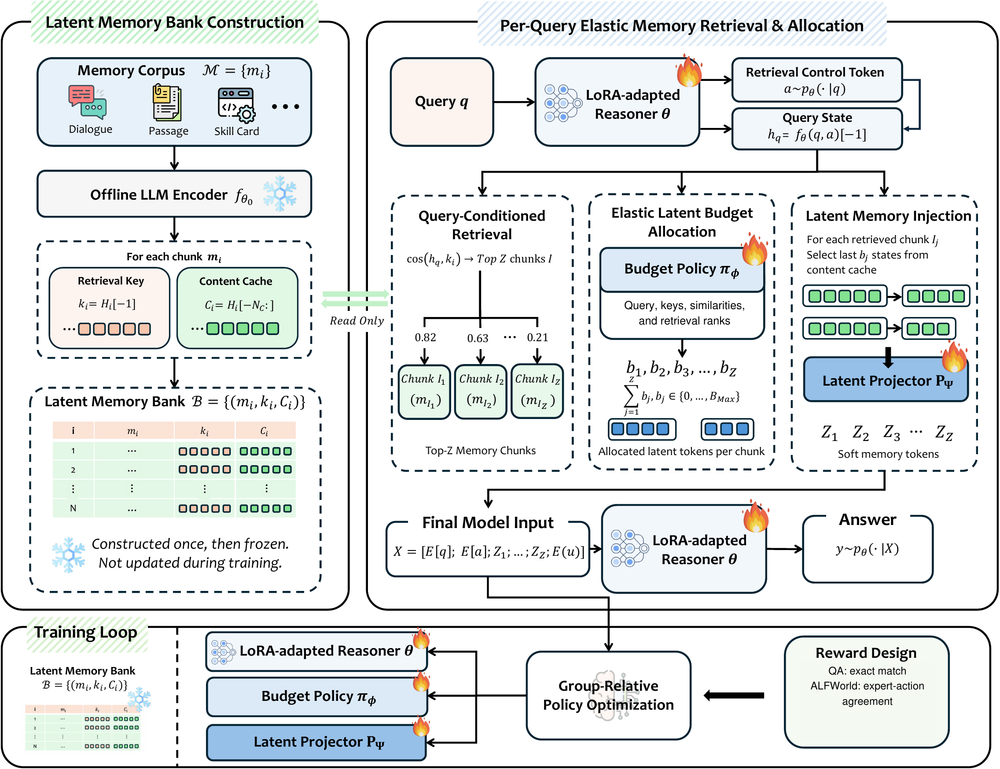

<div align="center">
  
</div>


<h1 align="center">ElasticMem: Latent Memory as a Learnable Resource for LLM Agents</h1>


<div align="center">
  <p>
    <a href='https://arxiv.org/abs/2605.30690'></a>
    <a href="https://huggingface.co/papers/2605.30690"></a>
    <br>
    <a href="https://github.com/ulab-uiuc/ElasticMem/stargazers"></a>
    <a href="https://github.com/ulab-uiuc/ElasticMem/forks"></a>
    <a href="https://github.com/ulab-uiuc/ElasticMem/issues"></a>
    <a href="LICENSE"></a>
  </p>
</div>


## 🧩 Overview

**ElasticMem** is a memory-augmented LLM framework that treats long-term memory as an **elastic latent resource**. Text-space memory methods paste retrieved memories into the context window, paying a large token cost; latent-space methods cut that cost but still use rigid retrieval and a fixed memory capacity. Either way, a query that needs one decisive memory and a query that needs ten get the same allocation.

ElasticMem learns the allocation instead. It encodes memories once into a latent memory bank, retrieves from the **reasoner's own hidden state**, lets a learned policy give each retrieved memory a **variable number of latent tokens**, and injects them as soft memory tokens. Retrieval, allocation, and generation are trained together with task reward via **GRPO**.

**Highlights**

- **Latent memory bank, built once** — each memory chunk (dialogue turn-pair, passage, or skill card) is encoded once by a frozen LLM into a retrieval key and a content cache.
- **Query-conditioned retrieval** — the query is the reasoner's hidden state after a learned control token, so retrieval is trained with the task.
- **Elastic budget allocation** — a small policy assigns each retrieved chunk its own latent-token budget, spending capacity where evidence is useful.
- **Soft-token injection** — memory enters the reasoner as projected latent states, costing latent tokens rather than context tokens.
- **End-to-end reward** — GRPO optimizes the whole memory-use process against task reward (exact match for QA, expert-action agreement for ALFWorld).

<div align="center">
  
</div>


## 📰 News

- 🚀 **[2026-10]**: **ElasticMem** is released, with code for all five MemorySuite benchmarks: PersonaMem-32K/128K, LoCoMo-MC10, LongMemEval-MC10, and ALFWorld.


## 📁 Repository Layout

```
ElasticMem/
├── elasticmem/            # the method
│   ├── pipeline.py        #   retrieval → budget allocation → latent injection → GRPO rollout
│   ├── policy.py          #   BudgetPolicy: per-chunk latent-token budget
│   ├── projector.py       #   hidden states → soft memory tokens
│   ├── data_utils.py      #   chunking + offline memory-bank encoding (cached by content hash)
│   ├── config.py          #   shared config
│   └── llm_judge.py       #   LLM helper used to build ALFWorld skill cards
├── tasks/                 # one entry point per benchmark
│   ├── personamem/        #   PersonaMem-32K / 128K
│   ├── locomo_mc10/       #   LoCoMo-MC10
│   ├── lme_mc10/          #   LongMemEval-MC10
│   └── alfworld/          #   ALFWorld: skill cards, training, live-env evaluation
├── scripts/               # train_*.sh / eval_*.sh; scripts/data/ for data preparation
├── data/                  # put datasets here; data/splits/ holds the frozen splits
└── assets/
```


## 🚀 Get Started

### Installation

```bash
git clone https://github.com/ulab-uiuc/ElasticMem
cd ElasticMem

conda create -n elasticmem python=3.10
conda activate elasticmem

pip install torch==2.6.0 --index-url https://download.pytorch.org/whl/cu124   # match your CUDA
pip install -r requirements.txt

# ALFWorld only
pip install "alfworld[full]" && alfworld-download
```

One GPU is enough: the 3B backbone fits on 24 GB, the 7B backbone needs about 40 GB to train. Our experiments use a single RTX A6000 (48 GB).

### 📊 Preparing Data

| Benchmark | Task | Size | Memory unit | Get it |
|---|---|---|---|---|
| PersonaMem-32K   | 4-choice MC | 589 Q / 37 contexts | turn-pair | [PersonaMem](https://huggingface.co/datasets/bowen-upenn/PersonaMem) → `data/` |
| PersonaMem-128K  | 4-choice MC | 2,727 Q / 60 contexts | turn-pair | same as above |
| LoCoMo-MC10      | 10-choice MC | 1,986 Q / 10 conversations | turn-pair | `bash scripts/data/download_locomo_mc10.sh` |
| LongMemEval-MC10 | 10-choice MC | 500 Q, one haystack each | turn-pair | `bash scripts/data/download_lme_mc10.sh` |
| ALFWorld         | embodied control | 140 seen / 134 unseen games | skill card | see below |

**PersonaMem** — place `questions_{32k,128k}.csv` and `shared_contexts_{32k,128k}.jsonl` in `data/`.

**LoCoMo-MC10 / LongMemEval-MC10** — the download scripts pull them into the Hugging Face cache; the loaders also download on first use.

**ALFWorld** — memory is a bank of procedural skill cards summarized from expert trajectories:

```bash
bash scripts/data/setup_alfworld.sh              # environment + game files
git clone https://github.com/ViktorAxelsen/MemSkill ../MemSkill
bash scripts/data/build_alfworld_replay.sh       # expert trajectories → data/
export GEMINI_API_KEY=...
bash scripts/build_skill_cards.sh                # trajectories → data/alfworld_skill_cards.json
```

Only the memory pool (80% of training games, `--memory-ratio 0.8`) is turned into skill cards; evaluation games never enter the bank.

**Splits** — `data/splits/` lists the exact train / val / test partitions (by context id, conversation id, or game file). LongMemEval-MC10 uses a seeded 80/20 random split (seed 42) defined in `tasks/lme_mc10/data_loader.py`.


## 🧪 Experiments

All scripts run from any directory, write checkpoints to `checkpoints/`, and default to the 3B backbone. For 7B, prefix with `MODEL="Qwen/Qwen2.5-7B-Instruct"`.

The first run on each dataset encodes the memory bank and caches it under `cache/`; later runs reuse it.

### 🖥️ Training

```bash
bash scripts/train_personamem.sh 32k     # or 128k
bash scripts/train_locomo.sh
bash scripts/train_longmemeval.sh
bash scripts/train_alfworld.sh           # after build_skill_cards.sh
```

### 🧭 Evaluation

```bash
bash scripts/eval_personamem.sh 32k  checkpoints/personamem_32k/best
bash scripts/eval_locomo.sh          checkpoints/locomo_mc10/best
bash scripts/eval_longmemeval.sh     checkpoints/lme_mc10/best
bash scripts/eval_alfworld.sh seen   checkpoints/alfworld/best
bash scripts/eval_alfworld.sh unseen checkpoints/alfworld/best
```

A checkpoint is a directory with `projector.pt`, `policy.pt`, and `lora_adapter/`.


## ⚙️ Key Settings

| | PersonaMem-32K | PersonaMem-128K | LoCoMo-MC10 | LongMemEval-MC10 | ALFWorld |
|---|---|---|---|---|---|
| `--top_z` (retrieved chunks) | 9 | 21 | 20 | 20 | 10 |
| `--n_tokens_max` (max latent tokens / chunk) | 20 | 20 | 20 | 20 | 20 |
| `--num_generations` (GRPO group) | 4 | 4 | 4 | 4 | 8 |
| `--lr` | 2e-5 | 2e-5 | 2e-5 | 2e-5 | 2e-5 |
| `--max_new_tokens` | 5 | 5 | 5 | 5 | 16 |

Other useful flags:

- `--cache_dir` — memory-bank cache. Use a separate directory per (dataset, backbone), since cached hidden states depend on the model.
- `--max_hidden_cache` — hidden states cached per chunk; must be ≥ `--n_tokens_max`.
- `--n_tokens_fixed` — replace the learned policy with a constant budget (ablation of elastic allocation).
- `--grad_ckpt` — gradient checkpointing to save training memory; no effect on inference.
- `--split_mode eval_only` — evaluate on all 500 LongMemEval-MC10 questions (used for transfer).
- ALFWorld: `--max_steps 30`, `--per_game_timeout 240`, `--history_steps 5`.

> [!NOTE]
> Memory encoding is one forward pass per chunk. On one A6000 it takes a few minutes for PersonaMem-32K, LoCoMo-MC10, and ALFWorld. LongMemEval-MC10 is the exception: 124k chunks across 500 per-question haystacks take about 1.5 h (3B) or 4 h (7B) and 14–25 GB of cache. It only happens once.


## 🙏 Acknowledgments

We thank the authors of **[PersonaMem](https://huggingface.co/datasets/bowen-upenn/PersonaMem)**, **[LoCoMo](https://github.com/snap-research/locomo)**, **[LongMemEval](https://github.com/xiaowu0162/LongMemEval)**, and **[ALFWorld](https://github.com/alfworld/alfworld)** for releasing their benchmarks, and **[MemSkill](https://github.com/ViktorAxelsen/MemSkill)**, whose ALFWorld expert-replay collector we reuse.


## 📚 Citation

```bibtex
@article{feng2026elasticmem,
  title={ElasticMem: Latent Memory as a Learnable Resource for LLM Agents},
  author={Feng, Tao and Ye, Chongrui and Yu, Fangxu and Luo, Tianyang and Xu, Jingjun and Xu, Xueqiang and Zhang, Haozhen and Zhang, Weizhi and Lei, Zijie and You, Jiaxuan},
  journal={arXiv preprint arXiv:2605.30690},
  year={2026}
}
```
